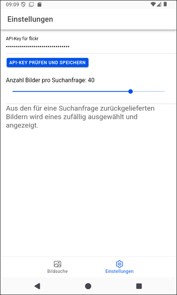

# Ionic-App "Bilder dynamisch von Web-API laden" #

 

Diese Repository enthält ein [Ionic](https://ionicframework.com/)/Angular-Projekt für eine mobile App,
die demonstriert, wie man Bilder dynamisch von einer Web-API (nämlich: [Flickr](https://www.flickr.com/services/developer/api/)) 
lädt.

 

----

## Screenshots ##

 

&nbsp;

 

----

## License ##

 

See the [LICENSE file](LICENSE.md) for license rights and limitations (BSD 3-Clause License) for the files in this repository.

 
